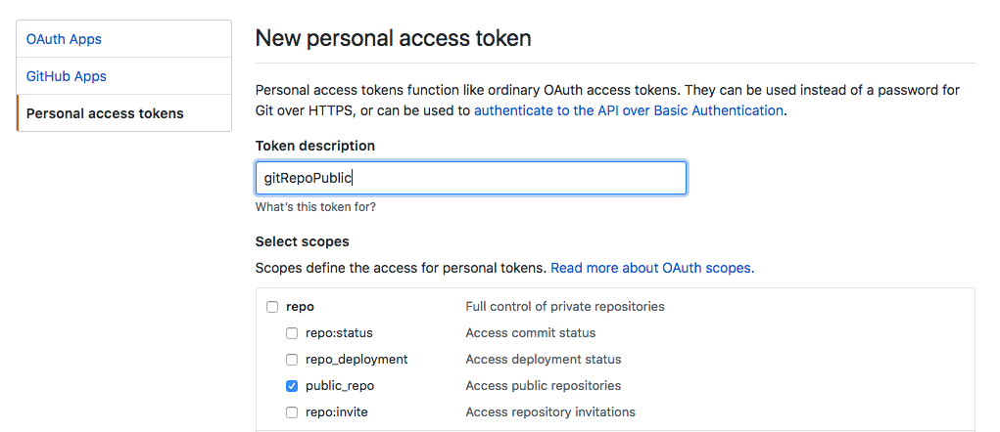

# OpenFaaS gitrepocount

[](https://microbadger.com/images/kacole2/gitrepocount "Get your own version badge on microbadger.com") [](https://microbadger.com/images/kacole2/gitrepocount "Get your own image badge on microbadger.com")

This repo contains an [OpenFaaS](https://github.com/openfaas/faas) function which uses the [google/go-github](https://github.com/google/go-github) Go library for the GitHub API to count how many repos an individual or group has. This uses pagination to continue counting.

## Deploying the Function

Make sure you have deployed an OpenFaaS stack to your cluster using the instructions on the [OpenFaaS repo](https://github.com/openfaas/faas).

### Use the CLI (`faas-cli`)

**Get the CLI**

The [faas-cli](https://github.com/openfaas/faas-cli) can be installed via `brew install faas-cli` or `curl -sSL https://cli.openfaas.com | sudo sh`.

### Create the Kubernetes Secret

The GitHub API limits unauthorized requests by rate limiting. Use your GitHub API Personal Access Token to get 5000 requests per hour. Go to your GitHub Settings -> Developer Settings -> Personal Access Tokens and "Generate new token". Only "Public" needs to be selected


With your new token, get the base64 encoded version with
```
echo -n '<insert token here>' | base64
```

Create a new secret file called `github-api-secret.yaml`
```
apiVersion: v1
kind: Secret
metadata:
  name: github-api-secret
  namespace: openfaas-fn
type: Opaque
data:
  github-api-secret: <base64 encoded secret>
```

Create the Kubernetes Secret:
```
kubectl create -f github-api-secret.yaml
```

### Deploy the function

Now deploy the function as follows:

```
# git clone https://github.com/kacole2/gitrepocount
# cd gitrepocount
// make any changes to the gitrepocount.yml file for OpenFaaS API gateway or if the secret has been renamed
# faas-cli deploy
200 OK
URL: http://localhost:31112/function/gitrepocount
```

### Testing the Function
Now that the function is running in your OpenFaaS environment you can test it from the command line by running:

```
$ curl localhost:31112/function/gitrepocount -d "kacole2"
$ {"user":"kacole2","repocount":58}
```

### License
Licensed under the Apache License, Version 2.0 (the “License”); you may not use this file except in compliance with the License. You may obtain a copy of the License at http://www.apache.org/licenses/LICENSE-2.0

Unless required by applicable law or agreed to in writing, software distributed under the License is distributed on an “AS IS” BASIS, WITHOUT WARRANTIES OR CONDITIONS OF ANY KIND, either express or implied. See the License for the specific language governing permissions and limitations under the License.
